# kong-oidc
## description
This plugin was initially started by a [Nokia open-source project](https://github.com/nokia/kong-oidc). Since the initial project has stopped being supported in 2019, it has been forked in 2021 by [another repo](https://github.com/revomatico/kong-oidc) which is archived since 2024.  
The plugin relies on the Nginx [lua-resty-openidc library](https://github.com/zmartzone/lua-resty-openidc) which is OIDC certified.
The lua-resty-openidc library allows an Nginx server to implement an Oauth2 resource server but it also allows to implement the responsibility of the OIDC Relying Party which off-load the responsibility from the front-end. Thanks to the library the state (access/ID/refresh tokens) of the session is encrypted and stored as a cookie.

The diagrams below provide more details on how this plugin works at runtime.  

```mermaid
  sequenceDiagram
      participant Client
      participant Kong as Kong OIDC Plugin
      participant Session as lua-resty-session
      participant OP as OpenID Provider
      participant RS as Resource Server

      Note over Client,RS: Authorization Code Flow (Interactive Authentication)

      Client->>+Kong: GET /protected-resource
      Kong->>Session: session.start() - check existing session
      Session->>Kong: return existing or new session
      
      alt user authentication is required
          Kong-->>Kong: Generate state, nonce, code_verifier
          Kong->>Session: Save authorization parameters
          Kong-->>Kong: Build authorization URL with PKCE
          Kong->>Client: 302 Redirect to OP authorization endpoint<br/>with state, nonce, code_challenge
          Client->>OP: GET /auth?response_type=code&client_id=...&state=...&nonce=...
          OP->>Client: Login page
          Client->>OP: POST credentials
          OP->>Client: 302 Redirect with authorization code<br/>to redirect_uri?code=xyz&state=...
          
          Client->>+Kong: GET /oauth2-callback?code=xyz&state=...
          Kong->>Session: Read state
          Kong-->>Kong: Validate state parameter
          Kong->>OP: POST /token<br/>grant_type=authorization_code<br/>code=xyz<br/>code_verifier=...
          OP->>Kong: {access_token, id_token, refresh_token}
          Kong->>Session: Read nonce
          Kong-->>Kong: Validate ID token signature & claims
          
          opt Userinfo endpoint configured
              Kong->>OP: GET /userinfo<br/>Authorization: Bearer <access_token>
              OP->>Kong: User profile data
          end
          
          Kong->>Session: Save tokens & user data in encrypted session
          Kong->>-Client: 302 Redirect to initial URL with Set-Cookie header
          Client->>+Kong: GET /protected-resource
          
      else Valid session exists
          Kong->>Session: Retrieve session data
          Session->>Kong: Tokens & user data
          Kong-->>Kong: Validate token expiration
          
          opt Token expired & refresh available
              Kong->>OP: POST /token<br/>grant_type=refresh_token<br/>refresh_token=...
              OP->>Kong: New access_token & id_token
              Kong->>Session: Update session with new tokens
          end
          
      end
      
      Kong->>RS: Forward request with injected headers<br/>(X-Userinfo, X-Access-Token, etc.)
      RS->>Kong: Response
      Kong->>-Client: Response with encrypted session cookie

      Note over Client,RS: Bearer Token Flow (API Authentication)

      Client->>+Kong: GET /api/resource<br/>Authorization: Bearer <jwt-token>
      Kong-->>Kong: Extract bearer token from Authorization header
      
      alt Bearer JWT verification enabled
          Kong->>OP: GET /.well-known/openid-configuration (cached)
          OP->>Kong: Discovery document with jwks_uri
          Kong->>OP: GET /jwks (if not cached)
          OP->>Kong: JSON Web Key Set
          Kong-->>Kong: Verify JWT signature using JWKS
          Kong-->>Kong: Validate claims (iss, aud, exp, nbf)
          
      else Token Introspection
          Kong->>OP: POST /introspect<br/>token=<access_token><br/>+client_auth
          OP->>Kong: {active: true/false, scope, exp, ...}
          Kong-->>Kong: Check token active status & scope
      end
      
      alt Token valid
          Kong->>RS: Forward request with headers
          RS->>Kong: Response
          Kong->>-Client: Response
      else Token invalid/expired
          Kong->>-Client: 401 Unauthorized<br/>WWW-Authenticate: Bearer realm="..."<br/>error="invalid_token"
      end

      Note over Client,RS: Logout Flow

      Client->>+Kong: GET /logout
      Kong->>Session: Retrieve session for id_token_hint
      Session->>Kong: Session data with id_token
      Kong->>Session: session.destroy()
      
      opt Revoke tokens on logout
          Kong->>OP: POST /revoke<br/>token=<access_token>
          Kong->>OP: POST /revoke<br/>token=<refresh_token>
      end
      
      Kong->>-Client: 302 Redirect to end_session and clear session cookie
      Client->>OP: GET /end_session<br/>?id_token_hint=<id_token><br/>&post_logout_redirect_uri=...
      OP->>Client: 302 Redirect to post_logout_redirect_uri
```


## build & run
Build Kong image embedded with the OIDC plugin
```
podman build -t kong:kong-oidc .
```

Create podman network
```
podman network create foo
```

Spin up Kong, Keycloak and a HTTP mock assuming the role of a secured application.
```
podman play kube pods.yml --net foo
```

Configure the HTTP mock to return headers proxied by Kong.  
```
curl -v -X PUT "http://localhost:1080/mockserver/expectation" -d '{
    "httpRequest": {
        "path": "/"
    },
    "httpResponseTemplate": {
        "template": "{ \"statusCode\": 200, \"body\": \"$!request.headers\" }",
        "templateType": "VELOCITY"
    }
}'
```

Import an OIDC client from `keycloak-client.json` file in keycloak running on `http://localhost:8080/admin/master/console/#/master/clients`.  

Browse the resource server at:
```
http://localhost:8000/some/path
```

Prometheus metrics are available on the admin port at `http://localhost:8001/metrics`.  

Logout:
```
http://localhost:8000/logout
```

Shutdown:
```
podman play kube pods.yml --down
```

## configuration
### user info
The [open-source plugin](https://github.com/revomatico/kong-oidc) ignores the `session_contents` configuration provided by the [Lua resty openidc library](https://github.com/zmartzone/lua-resty-openidc/tree/v1.7.6?tab=readme-ov-file#sample-configuration-for-google-signin).  
This field allows to control what is stored into the session.  
An improvement to the open-source plugin is made in `utils.get_options()` function to disable the requests to the user-info endpoint (as the ID token is already stored). Otherwise the user-info endpoint is called after the code exchange (but for some reason it's not updated after token request see https://github.com/zmartzone/lua-resty-openidc/blob/v1.7.6/lib/resty/openidc.lua#L1165).

# troubleshooting
## `request to the redirect_uri path, but there's no session state found`
This error is raised when the plugin fails to get the session from the cookie.  
There are multiple causes for this issue:
- misconfigured redirect URI: if the configured redirect URI is not specific enough (i.e. the same as the route exposed by Kong), the user will hit this endpoint directly (before being redirected to the authorization server) and before having receive any cookie. Then Kong OIDC plugin consider it has to perform a code exchange and fail trying to identify the session.
- inconsistent scheme: if the flow is initiated over HTTP but the redirect URI is using HTTPS then the cookie won't be sent to the redirect URI endpoint.
- session secret: if not set, a default secret is generated by the Kong workers leading to different secrets being used and workers unable to decrypt the session encrypted by another worker.
- `SameSite` cookie attribute: the session cookie used by the Kong OIDC plugin should be set to `Lax` or `None` so that it's set even if the user land in the endpoint from a link
- header limit: since the cookie contains access/ID/refresh tokens it might be truncate if there is reverse proxy in front of Kong
- session timeout: by default, the resty-session module expires the session after 15 minutes of inactivity. Therefore if the login process was idle for more than 15 minutes then this issue occurs.
- user bookmark: the redirections of the login flow should happen in two steps. First from Kong to the OpenId Provider, then from the OP back to Kong. If the user has bookmarked the login page of the OP, the next time he tries to login his session might not be recognized by Kong, espcially if the resty-session timeouts are not disabled (see [configuration schema](kong/plugins/oidc/schema.lua)).
## `state from argument: xxx does not match state restored from session: yyy`
- As explained in the thread below, if 2 authentication are happening in parallel from the same user agent there can be a race condition.  
  - tab1 is hitting the secured endpoint and receives a cookie with a state `s1`
  - then tab2 is hiting the secured endpoint and receives a cookie with a state `s2`
  - tab1 is authenticated against the IdP and redirected to the Kong gateway with a `state` query parameter `s1` while the cookie now contains the state `s2`   
  https://github.com/zmartzone/lua-resty-openidc/issues/482#issuecomment-1582584374
- user bookmark: the redirections of the login flow should happen in two steps. First from Kong to the OpenId Provider, then from the OP back to Kong. If the user has bookmarked the login page of the OP, the next time he tries to login his session might not be recognized by Kong.
