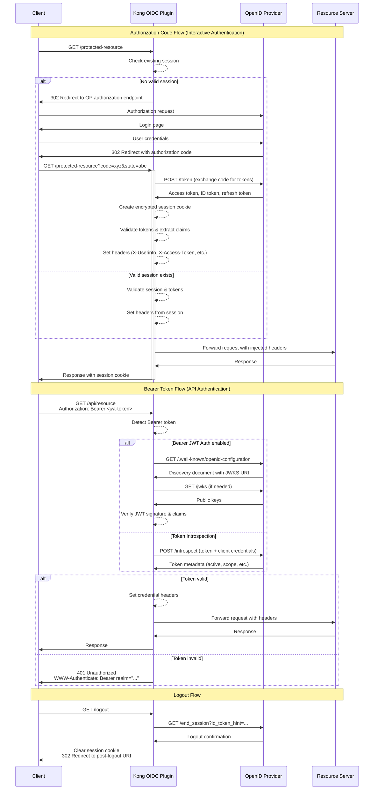

```mermaid
  sequenceDiagram
      participant Client
      participant Kong as Kong OIDC Plugin
      participant OP as OpenID Provider
      participant RS as Resource Server

      Note over Client,RS: Authorization Code Flow (Interactive Authentication)

      Client->>Kong: GET /protected-resource
      Kong-->>Kong: Check existing session
      alt No valid session
          Kong->>Client: 302 Redirect to OP authorization endpoint
          Client->>OP: Authorization request
          OP->>Client: Login page
          Client->>OP: User credentials
          OP->>Client: 302 Redirect with authorization code
          Client->>+Kong: GET /protected-resource?code=xyz&state=abc
          Kong->>OP: POST /token (exchange code for tokens)
          OP->>Kong: Access token, ID token, refresh token
          Kong-->>Kong: Create encrypted session cookie
          Kong-->>Kong: Validate tokens & extract claims
          Kong-->>Kong: Set headers (X-Userinfo, X-Access-Token, etc.)
      else Valid session exists
          Kong-->>Kong: Validate session & tokens
          Kong-->>Kong: Set headers from session
      end
      Kong->>RS: Forward request with injected headers
      RS->>Kong: Response
      Kong->>-Client: Response with session cookie

      Note over Client,RS: Bearer Token Flow (API Authentication)

      Client->>Kong: GET /api/resource<br/>Authorization: Bearer <jwt-token>
      Kong-->>Kong: Detect Bearer token
      alt Bearer JWT Auth enabled
          Kong->>OP: GET /.well-known/openid-configuration
          OP->>Kong: Discovery document with JWKS URI
          Kong->>OP: GET /jwks (if needed)
          OP->>Kong: Public keys
          Kong-->>Kong: Verify JWT signature & claims
      else Token Introspection
          Kong->>OP: POST /introspect (token + client credentials)
          OP->>Kong: Token metadata (active, scope, etc.)
      end
      alt Token valid
          Kong-->>Kong: Set credential headers
          Kong->>RS: Forward request with headers
          RS->>Kong: Response
          Kong->>Client: Response
      else Token invalid
          Kong->>Client: 401 Unauthorized<br/>WWW-Authenticate: Bearer realm="..."
      end

      Note over Client,RS: Logout Flow

      Client->>Kong: GET /logout
      Kong->>OP: GET /end_session?id_token_hint=...
      OP->>Kong: Logout confirmation
      Kong->>Client: Clear session cookie<br/>302 Redirect to post-logout URI
```