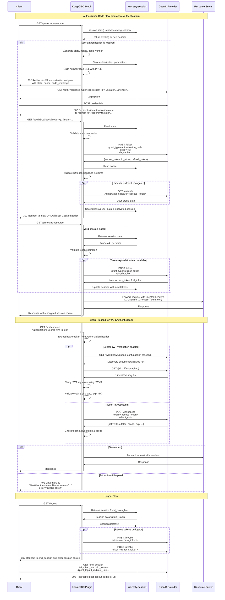

```mermaid
  sequenceDiagram
      participant Client
      participant Kong as Kong OIDC Plugin
      participant Session as lua-resty-session
      participant OP as OpenID Provider
      participant RS as Resource Server

      Note over Client,RS: Authorization Code Flow (Interactive Authentication)

      Client->>+Kong: GET /protected-resource
      Kong->>Session: session.start() - check existing session
      Session->>Kong: return existing or new session
      
      alt user authentication is required
          Kong-->>Kong: Generate state, nonce, code_verifier
          Kong->>Session: Save authorization parameters
          Kong-->>Kong: Build authorization URL with PKCE
          Kong->>Client: 302 Redirect to OP authorization endpoint<br/>with state, nonce, code_challenge
          Client->>OP: GET /auth?response_type=code&client_id=...&state=...&nonce=...
          OP->>Client: Login page
          Client->>OP: POST credentials
          OP->>Client: 302 Redirect with authorization code<br/>to redirect_uri?code=xyz&state=...
          
          Client->>+Kong: GET /oauth2-callback?code=xyz&state=...
          Kong->>Session: Read state
          Kong-->>Kong: Validate state parameter
          Kong->>OP: POST /token<br/>grant_type=authorization_code<br/>code=xyz<br/>code_verifier=...
          OP->>Kong: {access_token, id_token, refresh_token}
          Kong->>Session: Read nonce
          Kong-->>Kong: Validate ID token signature & claims
          
          opt Userinfo endpoint configured
              Kong->>OP: GET /userinfo<br/>Authorization: Bearer <access_token>
              OP->>Kong: User profile data
          end
          
          Kong->>Session: Save tokens & user data in encrypted session
          Kong->>-Client: 302 Redirect to initial URL with Set-Cookie header
          Client->>+Kong: GET /protected-resource
          
      else Valid session exists
          Kong->>Session: Retrieve session data
          Session->>Kong: Tokens & user data
          Kong-->>Kong: Validate token expiration
          
          opt Token expired & refresh available
              Kong->>OP: POST /token<br/>grant_type=refresh_token<br/>refresh_token=...
              OP->>Kong: New access_token & id_token
              Kong->>Session: Update session with new tokens
          end
          
      end
      
      Kong->>RS: Forward request with injected headers<br/>(X-Userinfo, X-Access-Token, etc.)
      RS->>Kong: Response
      Kong->>-Client: Response with encrypted session cookie

      Note over Client,RS: Bearer Token Flow (API Authentication)

      Client->>+Kong: GET /api/resource<br/>Authorization: Bearer <jwt-token>
      Kong-->>Kong: Extract bearer token from Authorization header
      
      alt Bearer JWT verification enabled
          Kong->>OP: GET /.well-known/openid-configuration (cached)
          OP->>Kong: Discovery document with jwks_uri
          Kong->>OP: GET /jwks (if not cached)
          OP->>Kong: JSON Web Key Set
          Kong-->>Kong: Verify JWT signature using JWKS
          Kong-->>Kong: Validate claims (iss, aud, exp, nbf)
          
      else Token Introspection
          Kong->>OP: POST /introspect<br/>token=<access_token><br/>+client_auth
          OP->>Kong: {active: true/false, scope, exp, ...}
          Kong-->>Kong: Check token active status & scope
      end
      
      alt Token valid
          Kong->>RS: Forward request with headers
          RS->>Kong: Response
          Kong->>-Client: Response
      else Token invalid/expired
          Kong->>-Client: 401 Unauthorized<br/>WWW-Authenticate: Bearer realm="..."<br/>error="invalid_token"
      end

      Note over Client,RS: Logout Flow

      Client->>+Kong: GET /logout
      Kong->>Session: Retrieve session for id_token_hint
      Session->>Kong: Session data with id_token
      Kong->>Session: session.destroy()
      
      opt Revoke tokens on logout
          Kong->>OP: POST /revoke<br/>token=<access_token>
          Kong->>OP: POST /revoke<br/>token=<refresh_token>
      end
      
      Kong->>-Client: 302 Redirect to end_session and clear session cookie
      Client->>OP: GET /end_session<br/>?id_token_hint=<id_token><br/>&post_logout_redirect_uri=...
      OP->>Client: 302 Redirect to post_logout_redirect_uri
```